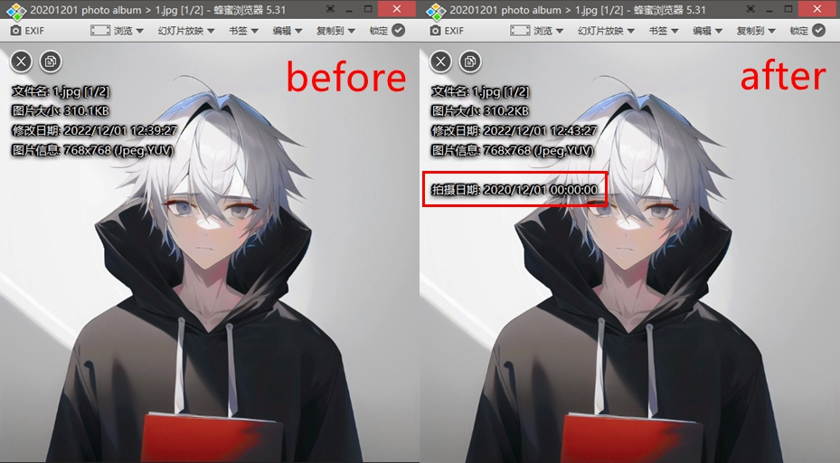

# time-writer

In order to ensure that the pictures and videos are displayed in an orderly manner on the timeline, write the time info in the EXIF of the JPG/JPEG files, for files that do not support EXIF, such as PNG and MP4, modify the file‘s create time, modify time and access time.

The time info of the file comes from the name of the parent directory.



# Example

```bash
# 1. Install requirements
$ pip install -r requirements.txt

# 2. Run time-writer.py
$ python time-writer.py --path 'testpic/' --date-format 'YYYYMMDD'
Done, photo time has been changed to 2020:12:01 00:00:00, 2020:12:01 00:00:00, 2020:12:01 00:00:00
```

# Options

- `--path PATH`：Input path, required.
- `--date-format FORMAT`: Set the format for getting the time info from the parent directory name. Support `YYYYMMDD`(default), `YYYY-MM-DD`, `YYYYMM` and `YYYY-MM`. Directory name example: `20201201 photo album`, `2020-12-01 photo album`, `202012 photo album`, `2020-12 photo album`.
- `--force`: Force the time information to be written into the EXIF of the JPG/JPEG file, even if the time information already exists in the EXIF.
